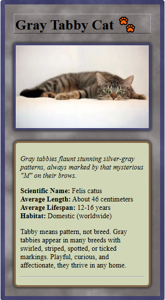
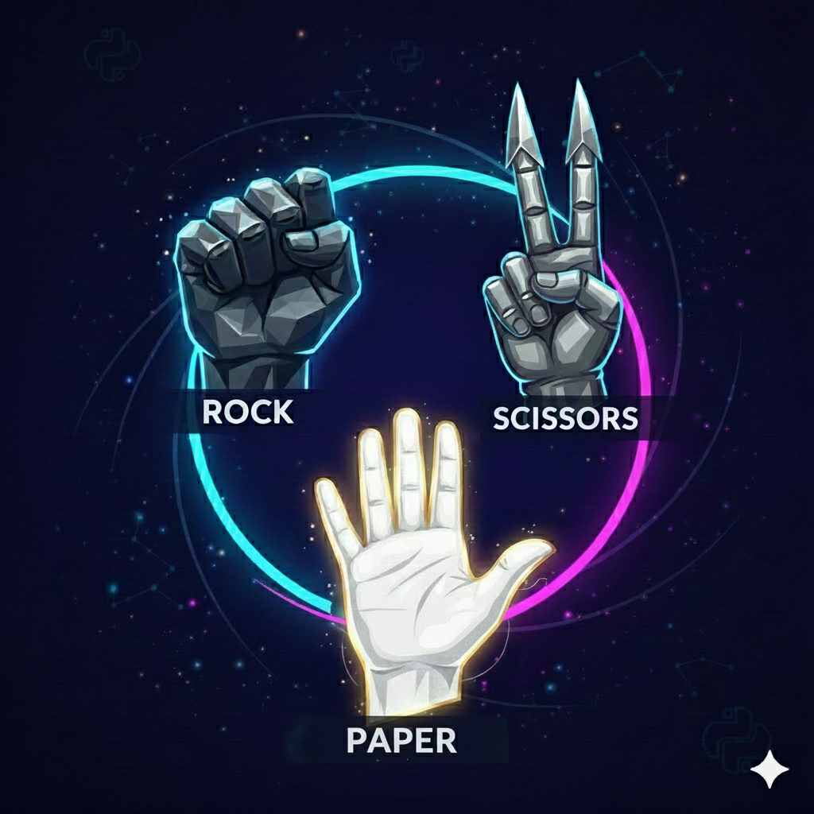
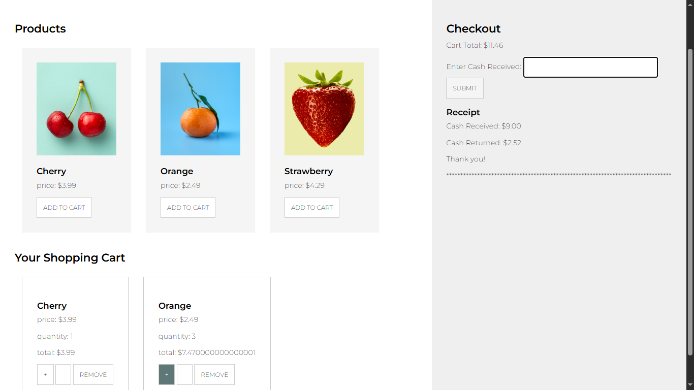

# 📚 Udacity – Intro to Programming Nanodegree Projects

### A Collection of Hands-on Programming Projects

*A repository containing projects from the Udacity Intro to Programming Nanodegree*

---

## 🚀 Projects Showcase

| | |
| :---: | :---: |
| **🐾 Animal Trading Cards** | **⚔️ Adventure Game** |
|  |  |
| **Skills:** `HTML` `CSS` `Web Design` | **Skills:** `Python` `Game Logic` `Functions` |
| Create digital trading cards with semantic HTML and CSS styling | A text-based adventure game featuring random enemies, branching story paths, and user input validation |
| **[📁 View Project](./animal-trading-cards)**  | **[📁 View Project](./adventure-game)** |
| | |
| **✂️ Rock Paper Scissors** | **🛒 Shopping Cart** |
|  |  |
| **Skills:** `Python` `OOP` `Game AI` `Strategies` | **Skills:** `JavaScript` `ES6` `DOM Manipulation` |
| An object-oriented implementation of Rock Paper Scissors with multiple computer AI strategies and score tracking | A functional shopping cart application with product management, quantity control, and checkout simulation |
| **[📁 View Project](./rock-paper-scissors)**  | **[📁 View Project](./shopping-cart)** |

---

**💡 Quick Access:** Click images to view code

